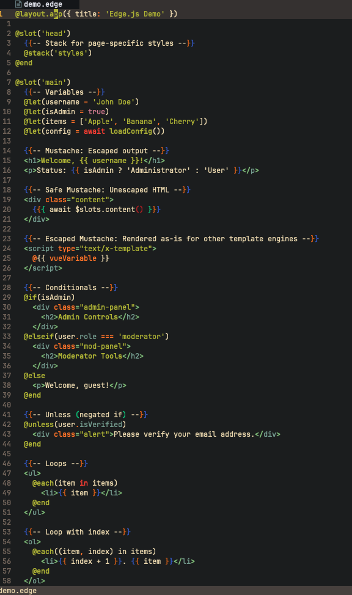

# Edge syntax support for Vim

This plugin provides file detection and syntax highlighting support for [Edge](https://edgejs.dev/docs/introduction) template files in Vim.

# Installation

> We recommend using [Vim plug](https://github.com/junegunn/vim-plug) for installation, but this plugin is compatible with other vim package managers

## Using vim-plug

```vim
Plug 'Yohannfra/edge.vim'
```

# Screenshot



The theme used in the screenshot is [Gruvbox dark](https://github.com/ellisonleao/gruvbox.nvim)

# Features

- Syntax highlighting for Edge template files
- File type detection
- Comment support (`{{-- --}}`)
- `gf` support: press `gf` on a template name to jump to the corresponding `.edge` file. The plugin automatically adds `resources/views`, `resources/views/components/**`, and `resources/views/pages/**` to the path, and appends `.edge` to suffixes.

# License

This plugin is licensed under the [MIT license](./LICENSE).
